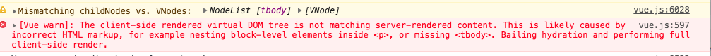

### Vue SSR from scratch
vue同构项目初探，参照官方介绍

> https://ssr.vuejs.org

> https://ssr.vuejs.org/api/

[TOC]

## What?

​	服务端渲染app也可以叫做同构的或者普通应用(相对于SPA)。我们使用Vue的大部分场景是构建单页面app, vue在浏览器中操纵DOM来产生我们想要的结果，实际上我们也可以在服务端使用vue来把vue组件渲染为`html`字符串，然后直接返回给客户端已经渲染了内容的首屏页面，而不是一个光秃秃的`<div id="root"></div>`标签，而浏览器中后续的应用逻辑则由vue在此基础上继续完成。


## Why?

1. 和单页面应用相比的优点：

- 对SSEO更加友好，所有路由均预先在服务端匹配出相应的内容，和传统网站一样有效内容可被爬虫抓取到。

  > SPA 所有页面均返回 `<div id="root"></div>`入口页html（`command + I + U`可以查看）,爬虫抓取不到任何有用内容

- 更快的首屏加载，没有SPA应用在弱网下首次加载长时间白屏的问题。

需要权衡的地方：

- 需要考虑一些第三方库在node环境运行的问题，做一些特殊考虑和处理
- 需要Node环境（这个应该不算什么问题）
- 相对纯前端应用，SSR应用算是CPU密集型，服务器压力大不少，需要考虑到服务器端的页面和组件缓存机制。

2. 和Prerender应用相比

>  prerender即把动态页面预先渲染好，生成一份静态html文件快照，前端请求时匹配到静态页面后直接返回静态页面。

- 如果是一些展示型页面（一般是非动态的），比如公司官网（通常是`首页`、`关于我们`、`联系我们`这种页面），这种情况Prerender可能更适合你，既简单，把静态页丢到第三方CDN服务器也没什么访问压力。
- 如果prerender不能满足你的要求，又希望网站对SEO友好，或者很好的加载速度，但你又习惯Vue来构建前端应用，这时候可以玩下SSR。

## How

​	进入正题之前，如果你正在寻找一个快速上手、开箱即用的解决方案，可以试下 [Nuxt.js](https://nuxtjs.org/)，它是一个更上层的解决方案，进行了一些抽象和优化，隐藏了许多配置，能让你快速上手进行SSR项目开发。


### Get Started

安装必要的依赖

```bash
npm install vue vue-server-renderer --save
```

首先，尝试用node代码渲染一个Vue组件，对`renderToString`建立最初的印象：

```javascript
// Step 1: Create a Vue instance
const Vue = require('vue')
const app = new Vue({
  template: `<div>Hello World</div>`
})

// Step 2: Create a renderer
const renderer = require('vue-server-renderer').createRenderer()

// Step 3: Render the Vue instance to HTML
renderer.renderToString(app, (err, html) => {
  if (err) throw err
  console.log(html)
  // => <div data-server-rendered="true">Hello World</div>
})

// in 2.5.0+, returns a Promise if no callback is passed:
renderer.renderToString(app).then(html => {
  console.log(html)
}).catch(err => {
  console.error(err)
})
```

然后，使用你喜欢的nodejs 服务器框架，这里是express的示例：

```bash
npm install express --save
```

```js
// app.js
const Vue = require('vue')
const server = require('express')()
const renderer = require('vue-server-renderer').createRenderer()

server.get('*', (req, res) => {
  const app = new Vue({
    data: {
      url: req.url
    },
    template: `<div>The visited URL is: {{ url }}</div>`
  })

  renderer.renderToString(app, (err, html) => {
    if (err) {
      res.status(500).send('Internal Server Error')
      return
    }
    res.send(`
      <!DOCTYPE html>
      <html lang="en">
        <head><title>Hello</title></head>
        <body>${html}</body>
      </html>
    `)
  })
});

server.listen(8080)
```

> 访问http://localhost:8080 ，会显示The visited URL is: [当前访问路径]

​	但是问题来了，`vue-server-renderer`只是帮我们渲染了Vue组件，在返回给前端之前我们必须手动包上`html`,`body`等标签来拼接成完整的html文件，像上面这样写运行完全没有问题，但是有时候需要额外拼接的内容可能会很多，为了更好滴组织代码，我们可以把这部分抽离出一个模板文件：

e.g (For example)

```html
<!DOCTYPE html>
<html lang="en">
  <head><title>Hello</title></head>
  <body>
    <!--vue-ssr-outlet-->
  </body>
</html>
```

> <!--vue-ssr-outlet--> 这部分会被`vue-server-renderer`识别并被注入组件渲染后的正确内容。

为了使用这个模板，我们只需要在创建renderer时添加`template`配置

```javascript
const renderer = createRenderer({
  template: require('fs').readFileSync('./index.template.html', 'utf-8')
})
```

模板还可以动态插值，在`renderToString`第二个参数传入需要插值到模板的数据：

```js
const context = {
  title: 'hello',
  meta: `
    <meta ...>
    <meta ...>
  `
}

renderer.renderToString(app, context, (err, html) => {
  // page title will be "Hello"
  // with meta tags injected
})
```

在html中即可获取到这些值

```html
<html>
  <head>
    <!-- use double mustache for HTML-escaped interpolation -->
    <title>{{ title }}</title>

    <!-- use triple mustache for non-HTML-escaped interpolation -->
    {{{ meta }}}
  </head>
  <body>
    <!--vue-ssr-outlet-->
  </body>
</html>
```

> 注意到{{{ }}}了吗，使用它来阻止HTML字符串被转译

​	再继续深入之前，我们需要花一点时间来讨论一下编写前后端都能运行的代码这个任务会给我们带来哪些限制？

​	由于平台和运行环境差异，我们的代码不可能在浏览器和node运行时环境中保持完全一样的行为，我们可能会关注到以下几点：

- 在一个纯前端应用中，我们在每次访问时会在浏览器中创建一个全新的app实例，在服务端我们希望这一点相同，每一次请求都要有一个全新的、彼此相互隔离的app实例以防请求之间的状态污染。

  获取数据的过程也不一样，在客户端我们可能会发送一个请求，拿到数据后更新state，但在服务器，页面state需要的数据应该在渲染之前就预先准备好，所以当渲染时所有的state都准备好了。

- 组件的生命周期的使用需要注意，服务端只是一次性出渲染模板就完事了，所以也不会有动态更新。因此只有`beforeCreate`和`created`这两个钩子函数会在进行服务端渲染时调用。所有其他的钩子函数，`beforeMount`、`mounted`...都只会在客户端才执行。


- 使用特定平台api的时候需要注意，比如你使用了`window`、`document`等浏览器中才有的对象，在node环境中会出现异常，反之亦然。

  意识到这个问题的时候，在使用这些api的时候，我们可以做一层包装适配不同的平台，或者使用一些帮你做好了跨平台兼容性的库，比如[axios](https://github.com/axios/axios)。

  对一些只能在客户端调用的api，我们可以丢到上面说的服务端不会调用的钩子函数中处理。

  如果你使用的第三方库没有考虑到跨平台调用的场景，把它加入到SSR中可能会有一些困难，你可能有办法通过模拟一些全局对象等方式hack一下，但有可能逃不过其依赖库的平台检测逻辑。

- Vue指令

很多自定义指令会直接操作DOM，因此在服务端调用渲染函数时会报错，对此有两种办法：

```markdown
1. 不要使用指令，用组件作为抽象单位来实现相同功能。
2. 如果你有一个不那么容易改写成组件的指令，你可以在创建renderer时配置`directives`参数指定一个服务端渲染专用的版本。 （？？不知道理解的对不对）
```

###  代码的组织

- ##### 避免使用包含状态的单例对象

  当编写纯前端应用时，我们的代码每次运行在一个全新的上下文中，但在Node中不一样，Node服务器是一个长时间远行的进程，我们把代码`require`后，便被放入内存中反复使用，但是客户端的请求回来自不同的客户端，如果你有一个单例的对象，这个对象会被在所有的请求之间共享。


  考虑到这个问题，我们在创建app实例时做了一点改动，在前端我们会直接创建一个app实例用于应用的整个生命周期中，但在node环境，我们用一个工厂方法来帮我们每次创建新的app实例，以防止请求间共用一个app实例导致的数据污染。

  ```javascript
  // app.js
  const Vue = require('vue')

  module.exports = function createApp (context) {
    return new Vue({
      data: {
        url: context.url
      },
      template: `<div>The visited URL is: {{ url }}</div>`
    })
  }
  ```

  我们的`server.js`这时候会变成这样：

  ```javascript
  // server.js
  const createApp = require('./app')

  server.get('*', (req, res) => {
    const context = { url: req.url }
    const app = createApp(context)

    renderer.renderToString(app, (err, html) => {
      // handle error...
      res.end(html)
    })
  })
  ```

  同样的，在创建router和store时也可以使用相同的方式。

  > 当创建renderer时设置`{ runInNewContext: true }`时，以上限制可以被忽略，因为renderer帮我们处理掉了这部分工作，但是这样做也需要考虑一定的性能损失，因为每一次请求都会创建一个新的`vm`实例。

- ##### 配置构建过程

  我们开始讨论如何把相同的Vue应用发布到客户端，为此，我们需要先使用webpack来构建我们的应用。实际上，服务端的Vue代码也需要用webpack来构建一下，因为：

  - 常见的Vue应用都用到了`vue-loader`，许多使用`webpack`指定方式引入的资源用到了`file-loader`，引入`css-loader`引入css文件到js代码中，不构建的话这些都不能在node环境中愉快的工作。
  - 尽管最新版的Node支持了大部分ES2015的特性，但是我们仍然需要迎合客户端的局限性，保证最终产出代码在浏览器的兼容，这也需要一个构建过程。

  基本的想法是我们把app针对浏览器和Node环境进行两次构建:

  

  具体的配置细节我们先放一下， 假设我们已经配置好了两套构建过程，我们可以先编写我们的app了。（下面到`配置构建`这一段，我们的程序都还不能实际运行，请先只关注实现逻辑）

  ```:8ball:
  app
  ├──	template
  │	└── index.template.html
  ├── server.js
  src
  ├── components
  │   ├── Foo.vue
  │   ├── Bar.vue
  ├── App.vue
  ├── app.js # universal entry
  ├── entry-client.js # runs in browser only
  └── entry-server.js # runs on server only
  ```

  ##### `app.js`

  ```javascript
  import Vue from 'vue'
  import App from './App.vue'

  // export a factory function for creating fresh app, router and store
  // instances
  export function createApp () {
    const app = new Vue({
      // the root instance simply renders the App component.
      render: h => h(App)
    })
    return { app }
  }
  ```

  ##### `entry-client.js`

  用户浏览器环境，创建app并挂载到DOM树中：

  ```javascript
  import { createApp } from './app'

  // client-specific bootstrapping logic...

  const { app } = createApp()

  // this assumes App.vue template root element has `id="app"`
  app.$mount('#app')
  ```

  ##### `entry-server.js`

  ```javascript
  import { createApp } from './app'

  export default context => {
    const { app } = createApp()
    return app
  }
  ```

  服务端构建入口文件，我们用了 `export default`暴露出一个模块，以供每次渲染时反复调用来创建新的app，现在我们只是创建了一个app实例，之后我们还会在这里进行路由匹配和数据预取等工作。

### 路由和代码分割

###### 路由

​	你可能注意到了，我们的server.js使用了通配符`*`来接受所有url请求，这让我们可以将访问的URL传入服务端运行的app实例中匹配当前路由，达到服务端和客户端感知到相同路由的目的。

> 传统的SPA应用服务器是不匹配在前端定义的路由的，返回相同的index.html文件是在没有匹配到后端路由的情况下的路由fallback配置策略决定。

​	推荐使用官方的`vue-router`实现路由功能，我们创建一个路由文件（记得之前提的我们要使用工厂方法来做）

```javascript
// router.js
import Vue from 'vue'
import Router from 'vue-router'

Vue.use(Router)

export function createRouter () {
  return new Router({
    mode: 'history',
    routes: [
      // ...
    ]
  })
}
```

然后更新`app.js`：

```javascript
// app.js
import Vue from 'vue'
import App from './App.vue'
import { createRouter } from './router'

export function createApp () {
  // create router instance
  const router = createRouter()

  const app = new Vue({
    // inject router into root Vue instance
    router,
    render: h => h(App)
  })

  // return both the app and the router
  return { app, router }
}
```

现在我们可以在服务端的`entry-server.js`中实现路由逻辑了：

```javascript
// entry-server.js
import { createApp } from './app'

export default context => {
  // since there could potentially be asynchronous route hooks or components,
  // we will be returning a Promise so that the server can wait until
  // everything is ready before rendering.
  return new Promise((resolve, reject) => {
    const { app, router } = createApp()

    // 设置服务端的路由
    router.push(context.url)

    // wait until router has resolved possible async components and hooks
    router.onReady(() => {
      const matchedComponents = router.getMatchedComponents()
      // no matched routes, reject with 404
      if (!matchedComponents.length) {
        return reject({ code: 404 })
      }

      // the Promise should resolve to the app instance so it can be rendered
      resolve(app)
    }, reject)
  })
}
```

假设服务端app已经打包好了，现在的`server.js`（先不要关注webpack配置，后面再说配置）

```javascript
// server.js
const createApp = require('/path/to/built-server-bundle.js')

server.get('*', (req, res) => {
  const context = { url: req.url }

  createApp(context).then(app => {
    renderer.renderToString(app, (err, html) => {
      if (err) {
        if (err.code === 404) {
          res.status(404).end('Page not found')
        } else {
          res.status(500).end('Internal Server Error')
        }
      } else {
        res.end(html)
      }
    })
  })
})
```

> `/path/to/built-server-bundle.js`就是打包后的 `entry-server.js`，该模块暴露出一个函数，签名是`function (context: renderContext) : Promise<AppInstance> => {} `；


###### 代码分割

代码分割，分割出我们代码中需要被懒加载的部分，可以减少页面初始化时首次加载的文件大小，打包后js文件较大时通过切割代码可以明显提升加载速度。简而言之就是<u>只加载首屏需要用到的代码</u>。


Vue提供了异步组件的概念，结合webpack2+的动态import特性，你只要用如下方式修改你的组件引入方式即可实现组件异步加载：

```javascript
// 修改前
import Foo from './Foo.vue'

// 修改后
const Foo = () => import('./Foo.vue')
```

> vue2.5以前，这只在路由级别的组件中有效，2.5+的版本中已经支持了所有组件的异步加载。

另外还需要注意的是，我们还是需要在挂载app之前使用`router.onReady`来保证异步组件先完成加载。刚才在`entry-server.js`中我们已经这么做了，我们现在把客户端入口也这么修改：

```javascript
// entry-client.js

import { createApp } from './app'

const { app, router } = createApp()

router.onReady(() => {
  app.$mount('#app')
})
```

路由配置：

```javascript
import Vue from 'vue';
import Router from 'vue-router';

Vue.use(Router);

export function createRouter () {
  return new Router({
    mode: 'history',
    routes: [
      { path: '/', component: () => import('./components/Foo.vue') },
      { path: '/bar', component: () => import('./components/Bar.vue') }
    ]
  });
}
```

### 数据预取和State同步

​	到目前为止，我们基本上已经可以渲染出我们app的快照了，但是还缺点什么。当我们的页面依赖一些本该在浏览器中使用XHR异步获取的数据时，我们在服务器上需要在渲染组件之前预先把这部分数据准备好，渲染组件时直接使用。

​	这时候在客户端，服务端预先准备好的相同数据需要能在渲染组件前准备好，否则客户端可能会从不同的初始数据开始渲染，那客户端就不能基于服务端给出的内容继续工作了。

​	为了解决这个问题，我们需要把预先获取到的数据放在一个专用的状态容器中，在服务器上我们可以先获取数据并在渲染前把准备好的数据注入到store中，客户端也可以模仿这个过程，但是不同的是缺少数据，所以我们决定把同一份数据序列化到html中一起返回给前端，前端程序起来之前先去拿这部分数据同样注入到前端的store中。

这样前后端app中store里的状态也同步了，nice!

##### 状态容器：vuex

我们使用官方提供的Vuex来管理状态，具体使用方法不在这里展开，我们创建一个store.js

```javascript
// store.js
import Vue from 'vue'
import Vuex from 'vuex'

Vue.use(Vuex)

// Assume we have a universal API that returns Promises
// and ignore the implementation details
import { fetchItem } from './api'

export function createStore () {
  return new Vuex.Store({
    state: {
      items: {}
    },
    actions: {
      fetchItem ({ commit }, id) {
        // return the Promise via `store.dispatch()` so that we know
        // when the data has been fetched
        return fetchItem(id).then(item => {
          commit('setItem', { id, item })
        })
      }
    },
    mutations: {
      setItem (state, { id, item }) {
        Vue.set(state.items, id, item)
      }
    }
  })
}
```

> 纯前端也是这么写，没什么不一样的

更新一下app.js，加入store

```javascript
// app.js
import Vue from 'vue'
import App from './App.vue'
import { createRouter } from './router'
import { createStore } from './store'
import { sync } from 'vuex-router-sync'

export function createApp () {
  // create router and store instances
  const router = createRouter()
  const store = createStore()

  // sync so that route state is available as part of the store
  sync(store, router)

  // create the app instance, injecting both the router and the store
  const app = new Vue({
    router,
    store,
    render: h => h(App)
  })

  // expose the app, the router and the store.
  return { app, router, store }
}
```

##### 数据获取的时机

​	问题又来了，我们在哪里触发数据获取逻辑呢？实际上某个特定路由需要的数据也即是该页面渲染的组件决定的，所以自然地应该在组件中获取数据。

​	我们在路由级别组件上暴露出一个静态方法`asyncData`，因为这个方法我们在组件初始化之前就需要调用，所以在这个方法中我们不必访问this来获取store和route，而是通过参数传给它：

```javascript
// Foo.vue
<template>
<div>
  <h1>Foo</h1>
  <div>{{ item.title }}</div>
</div>
</template>

<script>
export default {
  name: 'foo',
  asyncData ({ store, route }) {
    // 不能漏了return, 返回的Promise会传入下一步操作
    return store.dispatch('fetchItem', this.$route.params.id);
  },
  computed: {
    item() {
      return this.$store.state.items[1]
    }
  }
}
</script>

```

##### 在服务端获取数据

服务器端渲染时，我们可以通过`router.getMatchedComponents()`获取到当前路由匹配的页面组件，如果组件上存在asyncData方法，我们需要把数据获取好后传入渲染的context(上下文)对象中。

 ```javascript
import { createApp } from './app'

export default context => {
  return new Promise((resolve, reject) => {
    const { app, router, store } = createApp()

    router.push(context.url)

    router.onReady(() => {
      const matchedComponents = router.getMatchedComponents()
      if (!matchedComponents.length) {
        return reject({ code: 404 })
      }

      // call `asyncData()` on all matched route components
      Promise.all(matchedComponents.map(Component => {
        if (Component.asyncData) {
          return Component.asyncData({
            store,
            route: router.currentRoute
          })
        }
      })).then(() => {
        // After all preFetch hooks are resolved, our store is now
        // filled with the state needed to render the app.
        // When we attach the state to the context, and the `template` option
        // is used for the renderer, the state will automatically be
        // serialized and injected into the HTML as `window.__INITIAL_STATE__`.
        context.state = store.state

        resolve(app)
      }).catch(reject)
    }, reject)
  })
}
 ```

`context.state`序列化后的结果会被嵌入到最终的页面html文件中，赋值给全局变量window.__INITIAL_STATE__。客户端的store初始化时需要先把这些服务端传过来的状态值载入，

像这样：

```javascript
// entry-client.js

const { app, router, store } = createApp()

if (window.__INITIAL_STATE__) {
  store.replaceState(window.__INITIAL_STATE__)
}
```

##### 在客户端获取数据

客户端获取数据有两种策略：

​	1、路由跳转前获取数据

​	<font color="red">介绍:</font> 使用本策略，页面在获取万数据之前会保持当前路由，直到数据返回。这种方式的好处是路由跳转后页面可以立即完整的渲染出来，但是如果数据获取耗时比较长时，程序发出跳转指令时不会立即响应，会有一种卡住的错觉，通常是建议加个Loading交互来缓解这种尴尬和防止多次点击等误操作的风险。

​	<font color="red">实现:</font> 我们实现这种策略的方式是，使用一个全局的钩子函数中调用页面路由对应组件的`asyncData`方法，需要注意的时，最初渲染需要的数据在window.__INITIAL_STATE__中已经准备好了，所以我们需要的只是在首次渲染完成后的后续前端逻辑中加入这个数据获取逻辑，否则第一次渲染就相当于重复获取了两遍数据（服务端一次，客户端一次）。

```javascript
// entry-client.js

// ...omitting unrelated code

router.onReady(() => {
  // Add router hook for handling asyncData.
  // Doing it after initial route is resolved so that we don't double-fetch
  // the data that we already have. Using `router.beforeResolve()` so that all
  // async components are resolved.
  router.beforeResolve((to, from, next) => {
    const matched = router.getMatchedComponents(to)
    const prevMatched = router.getMatchedComponents(from)

    // we only care about non-previously-rendered components,
    // so we compare them until the two matched lists differ
    let diffed = false
    const activated = matched.filter((c, i) => {
      return diffed || (diffed = (prevMatched[i] !== c))
    })

    if (!activated.length) {
      return next()
    }

    // this is where we should trigger a loading indicator if there is one

    Promise.all(activated.map(c => {
      if (c.asyncData) {
        return c.asyncData({ store, route: to })
      }
    })).then(() => {

      // stop loading indicator

      next()
    }).catch(next)
  })

  app.$mount('#app')
})
```

​	2、数据获取不影响路由跳转

​	<font color="red">		介绍：</font>第二种策略是数据的获取不阻塞路由的跳转，把数据获取放到`beforeMount`生命周期中，这样能给人更快的页面交互感受。但是跳转到的页面可能并没有立即准备好数据，因此使用这种策略时，这些刚开始没有准备好数据的组件需要增加加载中状态来提示用户数据还没有准备好。

​	<font color="red">实现：</font> 我们可以添加一个全局Mixin来实现这种策略：

```javascript
Vue.mixin({
  beforeMount () {
    const { asyncData } = this.$options
    if (asyncData) {
      // assign the fetch operation to a promise
      // so that in components we can do `this.dataPromise.then(...)` to
      // perform other tasks after data is ready
      this.dataPromise = asyncData({
        store: this.$store,
        route: this.$route
      })
    }
  }
})
```

> ​	这两种策略没有好坏之分，取决于具体的UX设计，我们可以根据实际的需求来决定合适的数据加载时机。

不管你采用哪种方式，你还要考虑的是当前组件被复用时如何更新数据，比如路由从`/user/1` 切换到`user/2`，组件并没有变化，我们需要重新获取数据更新UI。

那就再写一个`mixin`吧：

```javascript
Vue.mixin({
  beforeRouteUpdate (to, from, next) {
    const { asyncData } = this.$options
    if (asyncData) {
      asyncData({
        store: this.$store,
        route: to
      }).then(next).catch(next)
    } else {
      next()
    }
  }
})
```

##### store的代码切割

在大型应用中，`Vuex`的store会被分离为不同的modules。这些module同样可以被根据其相关的路由分割到不同的chunk中，比如我们有以下module:

```js
// store/modules/foo.js
export default {
  namespaced: true,
  // IMPORTANT: state must be a function so the module can be
  // instantiated multiple times
  state: () => ({
    count: 0
  }),
  actions: {
    inc: ({ commit }) => commit('inc')
  },
  mutations: {
    inc: state => state.count++
  }
}
```

我们可以使用`store.registerModule`在组件的`asyncData`钩子中来懒加载并注册这些module：

```javascript
// inside a route component
<template>
  <div>{{ fooCount }}</div>
</template>

<script>
// import the module here instead of in `store/index.js`
import fooStoreModule from '../store/modules/foo'

export default {
  asyncData ({ store }) {
    store.registerModule('foo', fooStoreModule)
    return store.dispatch('foo/inc')
  },

  // IMPORTANT: avoid duplicate module registration on the client
  // when the route is visited multiple times.
  destroyed () {
    this.$store.unregisterModule('foo')
  },

  computed: {
    fooCount () {
      return this.$store.state.foo.count
    }
  }
}
</script>

```

这种编写方式下，这个module是这个组件的独立依赖模块，所以会被打包至这个组件的chunk中。

>这个部分写了很多代码，因为数据获取是一个SSR app中最复杂的部分，我们现在已经为后面的开发奠定了基础，这个骨架搭建好之后，后面的开发会轻松很多。

### 客户端的合成（浏览器和服务器的接力）

>  大白话：前面服务器已经完成了它的任务——返回当前路由的HTML结构，浏览器拿到这个HTML和state数据后继续加工，生成一个可正常处理后续js交互的完整功能页面。

前面的代码中我们已经实现了，客户端挂载app的代码：

```javascript
app.$mount('#app')
```

​	既然服务器已经渲染好了当前页面的组件，我们显然没必要丢掉这部分重新创建DOM元素并挂载，我们要用已有的静态HTML标签，并把他们变得“可交互”。

​	如果你检查服务端渲染的元素，你会看到如下特殊标签：

```javascript
<div id="app" data-server-rendered="true">
```

注意，它默认是没有`id=app`的，只有 `data-server-rendered`，你要在根组件上自己加上这个id否则会报错：


所以，在`App.vue`中手动加入id:

 ```javascript
<template>
<div id="app">
  <p>Vue 同构测试</p>
  <hr />
  <router-view></router-view>
</div>

</template>
 ```

​	⚠️在开发(`development`)模式下，Vue加入了断言机制，认为服务器返回的DOM结构和客户端生成的DOM结构是一致的，如果检测到不匹配，合成过程会失败，程序会放弃当前DOM从头开始渲染。在生产(`production`)模式下，出于性能考虑，这一检测机制是被禁用的。

> 高能预警：使用SSR+客户端合成生成页面时，一些特殊的HTML结构可能会在浏览器中出现警告信息，举例：你有如下组件：
>
> ```
> <table>
>   <tr><td>hi</td></tr>
> </table>
> ```
>
> 浏览器端vue在渲染时会自动将`<tbody>`加入到`<table>`标签中，但是服务端`VirtureDOM`生成的结构不包含`<tbody>`，这就导致了不匹配，浏览器会出现如下警告：
>
> 
>
> <font color="red">[Vue warn]: The client-side rendered virtual DOM tree is not matching server-rendered content. This is likely caused by incorrect HTML markup, for example nesting block-level elements inside <p>, or missing <tbody>. Bailing hydration and performing full client-side render.</font>
>
> 所以为了避免这个问题，请使用符合标准的HTML写法。

### Bundle Renderer介绍

​	在这之前，我们都假设打包后的服务端代码会被这么使用：

```javascript
const createApp = require('/path/to/built-server-bundle.js')
```

这很直白，一目了然。但是每次你改动了源代码后都需要`编译`-`停止node服务`-`重启`才可以看到更新后的结果，这是比较糟糕的开发体验，而且Node也没有原生支持解析source map。

​	`vue-server-renderer`提供了`createBundleRender`来处理这个问题。结合第三方webpack插件，服务端构建的bundle结果被映射为一个JSON文件的形式（它其实是对`src`中源码的映射和直接使用），把该JSON文件直接作为参数传给`createBundleRender` 我们的服务端程序就获得了构建后的App实例。

```javascript
const { createBundleRenderer } = require('vue-server-renderer')
const serverBundle = path.resolve(__dirname, './ssr-bundle/vue-ssr-server-bundle.json');
const template = require('fs').readFileSync('./app/template/index.template.html', 'utf-8'),
const renderer = createBundleRenderer(serverBundle, {
  runInNewContext: false, // recommended
  template, // (optional) page template
})
// 后面内容省略...
```

> 建议将`runInNewContext`设为`false`或者`once`， 更多信息请[查看文档](https://ssr.vuejs.org/api/#runinnewcontext)

### 配置构建

假设你已经会用webpack来配置纯前端程序的打包过程了，SSR项目的配置大部分是类似的，推荐将配置拆分为三个文件`base`、`client`、`server`。不言而喻`base`是前后端公用的配置，另外两个是平台差异配置。

##### 服务端：`webpack.server.config.js`

```javascript
// webpack.server.config.js
const merge = require('webpack-merge')
const nodeExternals = require('webpack-node-externals')
const baseConfig = require('./webpack.base.config.js')
const VueSSRServerPlugin = require('vue-server-renderer/server-plugin')

module.exports = merge(baseConfig, {
  // Point entry to your app's server entry file
  entry: path.resolve(__dirname, '../src/entry-server.js'),

  // This allows webpack to handle dynamic imports in a Node-appropriate
  // fashion, and also tells `vue-loader` to emit server-oriented code when
  // compiling Vue components.
  target: 'node',

  // For bundle renderer source map support
  devtool: 'source-map',

  // This tells the server bundle to use Node-style exports
  output: {
    libraryTarget: 'commonjs2'
  },

  // https://webpack.js.org/configuration/externals/#function
  // https://github.com/liady/webpack-node-externals
  // Externalize app dependencies. This makes the server build much faster
  // and generates a smaller bundle file.
  externals: nodeExternals({
    // do not externalize dependencies that need to be processed by webpack.
    // you can add more file types here e.g. raw *.vue files
    // you should also whitelist deps that modifies `global` (e.g. polyfills)
    whitelist: /\.css$/
  }),

  // This is the plugin that turns the entire output of the server build
  // into a single JSON file. The default file name will be
  // `vue-ssr-server-bundle.json`
  plugins: [
    new VueSSRServerPlugin()
  ]
})
```

​	用该配置打包后，会产生一个`vue-ssr-server-bundle.json`文件，直接把他传入`createBundleRenderer`方法即可。（上面已经有例子了）


⚠️注意一下我们把css文件加入到`externals`配置中，这是因为作为依赖引入的css还是需要webpack的特定的方式来处理，Node是无法处理的。同样地，`*.vue`、`*.sass`等文件同理需要加入 `externals` 中。

如果你使用了`runInNewContext: 'once'`或者`runInNewContext: true`，你需要把那些会操作全局`global`对象的polyfills加入到`externals`，因为在new context模式下，服务端有自己的`global`对象，如果你在服务器端并不一定需要引入（比如Node 7.6+不需要babel-polyfill文件），你可以只在客户端引入。

##### 客户端`webpack.client.config.js`

​	客户端基本上都是使用base里的配置，显然首先把`entry`设为客户端入口`entry-client.js`。

​	还有一点要注意的是如果你要使用 `CommonsChunkPlugin`，请仅在客户端构建中使用，服务端版本构建中是不能用的。

##### 生成clientManifest

​	不仅服务端构建会产生一个描述bundle的JSON文件，客户端构建后也会生成一个`clientManifest`(文件名默认是：`vue-ssr-client-manifest.json` )文件，有了这两个文件，`bundleRender`可以获取到两个版本的信息，可以把正确的标签注入到HTML文件中了。这有两方面重要作用：

- 可以替代`html-webpack-plugin`来生成带有hash的文件名。
- 客户端有code split 配置时，会生成一些懒加载文件，这些服务端是不知道的，所以要通过clientManifest文件告诉`bundleRender`应该在返回的HTML 中嵌入哪些对应前端构建结果中的<script>标签

配置示例：

```javascript
const webpack = require('webpack')
const merge = require('webpack-merge')
const baseConfig = require('./webpack.base.config.js')
const VueSSRClientPlugin = require('vue-server-renderer/client-plugin')

module.exports = merge(baseConfig, {
  entry: path.resolve(__dirname, '../src/entry-server.js'),
  optimization: {
    splitChunks: {
      chunks: 'all',
      name: true,
      cacheGroups: {
        vendors: {
          test: /[\\/]node_modules[\\/]/,
          name: 'vendor',
        },
      },
    },
    runtimeChunk: {
      name: 'manifest',
    },
  },
  plugins: [
    // Important: this splits the webpack runtime into a leading chunk
    // so that async chunks can be injected right after it.
    // this also enables better caching for your app/vendor code.
    // This plugins generates `vue-ssr-client-manifest.json` in the
    // output directory.
    new VueSSRClientPlugin()
  ]
})
```

> webpack4中`CommonChunksPlugin` 改为了`optimization.splitChunks`配置

生成的客户端manifest文件可以像下面这样使用：

```javascript
const { createBundleRenderer } = require('vue-server-renderer')

const template = require('fs').readFileSync('/path/to/template.html', 'utf-8')
const serverBundle = require('/path/to/vue-ssr-server-bundle.json')
const clientManifest = require('/path/to/vue-ssr-client-manifest.json')

const renderer = createBundleRenderer(serverBundle, {
  template,
  clientManifest
})
```

这样修改后，前后端构建结果运行起来后，后段返回的HTML 应该像下面这样：

```html
<html>
  <head>
    <!-- chunks used for this render will be preloaded -->
    <link rel="preload" href="/manifest.js" as="script">
    <link rel="preload" href="/main.js" as="script">
    <link rel="preload" href="/0.js" as="script">
    <!-- unused async chunks will be prefetched (lower priority) -->
    <link rel="prefetch" href="/1.js" as="script">
  </head>
  <body>
    <!-- app content -->
    <div data-server-rendered="true"><div>async</div></div>
    <!-- manifest chunk should be first -->
    <script src="/manifest.js"></script>
    <!-- async chunks injected before main chunk -->
    <script src="/0.js"></script>
    <script src="/main.js"></script>
  </body>
</html>
```

##### 手动引用资源

​	默认情况下，当你指定template后，资源的注入是自动的，但如果你想更细粒度第控制资源的引入方式，你可以传入`inject: false`，然后手动指定引入的内容。

​	在`renderToString`的回调中，context参数会暴露一些帮助方法来帮助我们：

- `context.renderStyles()` 帮我们生成内联style标签和潜入外联方式引入css的标签;
- `context.renderState(options?: Object)` 帮我们把序列化后的`context.state`作为`window.__INITIAL_STATE__`的值嵌入到html;
- `context.renderScripts()` 生成script标签
- `context.renderResourceHints()`
- `context.getPreloadFiles()`

因为穿入`createBundleRenderer`的`template`模板会先用`context`插值，所以你可以在模板里调用这些帮助方法。

```html
<html>
  <head>
    <!-- use triple mustache for non-HTML-escaped interpolation -->
    {{{ renderResourceHints() }}}
    {{{ renderStyles() }}}
  </head>
  <body>
    <!--vue-ssr-outlet-->
    {{{ renderState() }}}
    {{{ renderScripts() }}}
  </body>
</html>
```

> 这里我们省略了`webpack.base.config.js`的内容，看这篇文章的你应该都会配置的吧，就不在此赘述。

接着我们在`package.json`中添加几个脚本：

```json
{
    "scripts": {
        "build-server": "webpack --config build/webpack.server.config.js --progress",
        "build-client": "webpack --config build/webpack.client.config.js --progress",
        "build": "npm run build-client & npm run build-server",        
    }
}
```

编译代码：

```bash
$ npm run build
$ node|supervisor ./app/server.js
```

这时候访问localhost:8080,可以看到如下页面：


`Command + I + U`查看服务端返回的html文件，可以看到和SPA的区别，首页的DOM结构都渲染好了：


到此为止，我们应该已经有了一个可以运行的项目骨架了（当然我们省略了一些代码细节），虽然它可能比较简陋，但对于理解SSR的主体流程已经够了，实际代码可以参照项目文件。